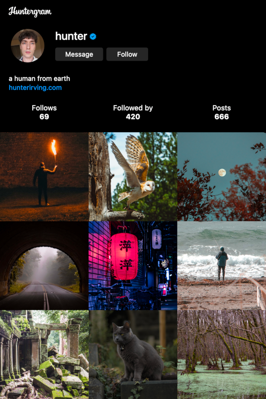
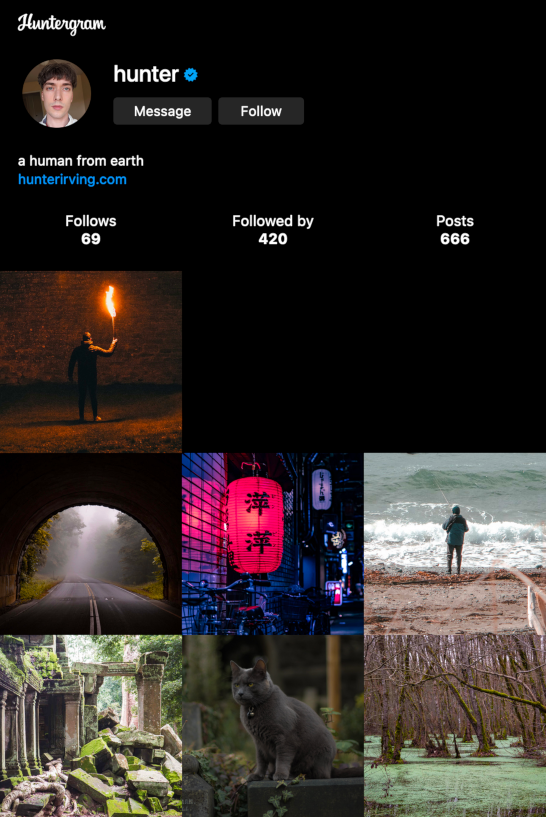
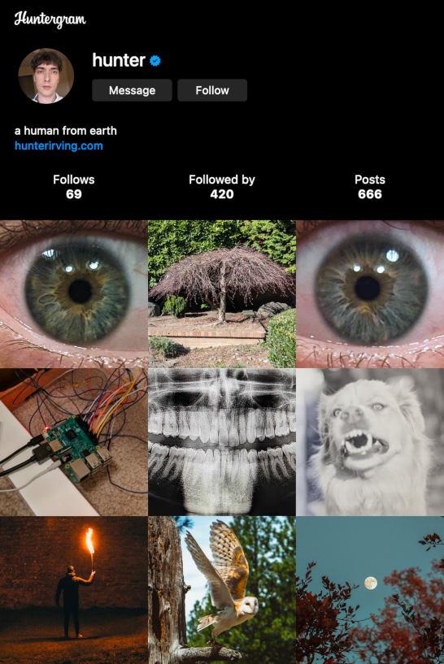
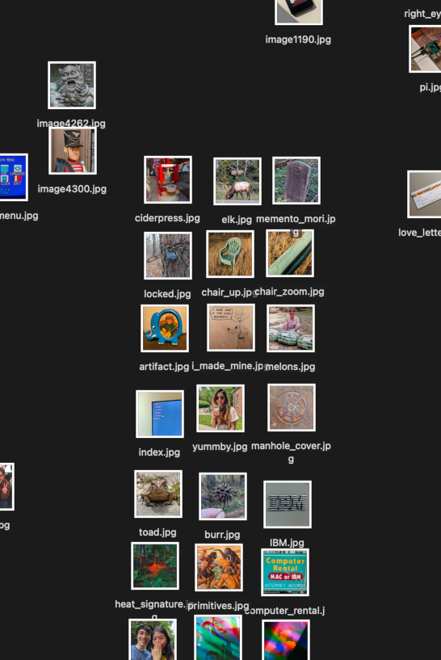

# Huntergram
Huntergram is a free photo sharing site that you host yourself. It's written in pure HTML, raw CSS, and vanilla JavaScript.

## features
* a strictly finite information feed, curated by you
* a completely static site that you can host on GitHub pages, Glitch, NeoCities, or anywhere else
* a responsive design that scales to fit desktop and mobile web browsers
* "functioning" like, follow, and message buttons
* a ragged leading edge that lets you add new photos in amounts that are not necessarily multiples of three without shifting your existing photos around relative to one another
  * 
  * this "ensured stability" lets you arrange photos spatially
    * the resulting bricolage can be used to share context or recontextualize images based on their proximity to others
    * 
* <a href="https://www.youtube.com/watch?v=ZBvvCdhLKdw">lazily-loaded images</a> ensure the site loads quickly regardless of how many pictures you add

## bring your own workflow
* Huntergram's source code just renders a website
  * how you prepare your images, modify the index.html file to reference them, and get your files into your hosting platform is up to you
    * you could write a script to do it for you
    * or you could do it my way

## my workflow
* open a raw image in Gimp
  * if the image is not square, crop it to be square
  * if the image is really big, scale it down to somewhere in the neighborhood of 1200 x 1200 pixels
  * export the modified image to the /content directory as a progressive JPEG
  * using Gimp's export preview, use the slider to find an appropriate balance between quality and filesize
      * for 1200x1200-ish images, you can usually go down to around 100kB to 200kB without a serious dip in visual quality
* using my computer's file browser, mock up and select from potential photo arrangements
  * 
* open index.html in Vim
  * if a new row needs to be added...
    * copy the conveniently-placed, commented out "row" div
    * paste it wherever i want it to be
  * update the image src attributes to reference the desired photos
* run a python script (not included) to push the updated files to my hosting platform
  * WARNING: photos can contain all kinds of metadata, including GPS coordinates
    * you probably don't wanna upload that to the Internet
    * you can strip image metadata using a program like <a href="https://exiftool.org/">exiftool</a>
      * an example script, strip_metadata.py, is provided, which uses exiftool to strip all metadata from all images in the /huntergram directory

## a simple spell, but quite unbreakable
* huntergram.js includes a <a href="https://en.wikipedia.org/wiki/ROT13">rot13</a> encoder-decoder
  * you can use this to obfuscate your email address enough that bots won't bother finding it, while retaining the ability   to be contacted

## attribution
* the photos displayed at <a href="https://hunterirving.com/huntergram">hunterirving.com/huntergram</a> are taken by me
* the example photos included in this repository and on the <a href="https://hunterirving.github.io/Huntergram/">GitHub pages live demo</a> are royalty-free images provided by <a href="https://unsplash.com/photos/5DIFvVwe6wk">Linus Sandvide</a>, <a href="https://unsplash.com/photos/8hIErEH5pr0">Ronan Furuta</a>, <a href="https://unsplash.com/photos/aFMsnhkZoJg">Griffin Wooldridge</a>, <a href="https://unsplash.com/photos/gmy25xvSkq8">Aaron Burden</a>, <a href="https://unsplash.com/photos/oCZHIa1D4EU">Jase Bloor</a>, <a href="https://unsplash.com/photos/EOc0OgfHecs">Helen Ngoc N.</a>, <a href="https://unsplash.com/photos/GSCtoEEqntQ">Ralph Howald</a>, <a href="https://unsplash.com/photos/rgcJWAxaubg">Edward Howell</a>, <a            href="https://unsplash.com/photos/m0brfG9nMPs">Arsalan Arianmehr</a>, <a href="https://unsplash.com/photos/Mn3lkbSQRLY">Daniel Lincoln</a>, <a href="https://unsplash.com/photos/alY6_OpdwRQ">Jezael Melgoza</a>, <a href="https://unsplash.com/photos/EfqQLK5T_lE">Rafael Hoyos Weht</a>, <a href="https://unsplash.com/photos/PpKla8Qtv8c">Karsten Winegeart</a>, <a href="https://unsplash.com/photos/lJ6iASrFAnQ">Kenny Eliason</a>, and <a href="https://unsplash.com/photos/9P2-bzjvIHk">Dawid Zawiła</a>.

PS: you can change the "Hunter" in Huntergram to your name if you want to :-)
